# Outdated-Volvo-P2-Nav-Retrofit-Guide-for-Android-Auto-Multimedia
> [!IMPORTANT]
> **Project Status: Work in Progress (WIP)**
...

Designed specifically for Volvo P2 models lacking the factory-installed RTI navigation system. 

## Hardware:
- Raspberry Pi 5, 8 GB RAM + RPi Active Cooler;
- Power supply, minimum 27W [Traco Power](https://www.tracopower.com/int/model/tmdc-40-2411);
- USB SSD 120GB, R/W speed up to 500MB/s* [Emtec](https://www.emtec-international.com/en/ssd/internal/x150-ssd-power-plus);
- 4 port USB-A HUB, powered [Startech.com](https://www.startech.com/en-us/usb-hubs/h5a4a-usb-hub);
- USB to LIN Interface [fischl](https://www.fischl.de/order/);
- Arduino Uno (China clone) + Prototype Screw Shield Expansion Board;
- CAN-BUS Shield v1.2 [seeedstudio/ElecFreaks](https://wiki.seeedstudio.com/CAN-BUS_Shield_V1.2/);
- OEM Volvo Steering Wheel Nav Controls [used car parts](https://www.volvopartswebstore.com/products/1179711/8685489.html);
- OEM Volvo RTI screen [used car parts](https://www.volvopartswebstore.com/products/Volvo/2005/S60-24l-5-cylinder/GPS-Navigation-System/1121718/30775626.html);

## Software:
- OS Debian GNU/Linux 13 "Trixie";
- Hudiy infotainment system software, [github](https://github.com/wiboma/hudiy);

## Making LIN Work
The goal of this project is to retrofit the stock low-res RTI monitor with its simple non-touch LCD. Since there’s no touchscreen, the steering wheel buttons are essential for navigating and controlling the display. There are two ways to get those buttons physically in place: replace the entire wheel, or fit just the nav button module. I chose the second option for this pilot build:

  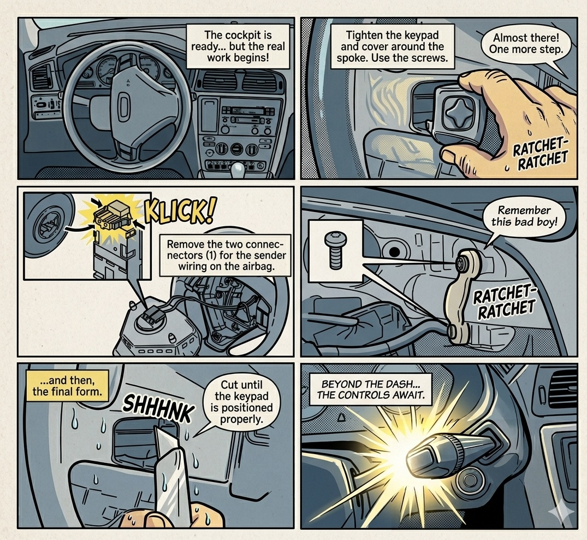
   
  <i>This NAV button installation guide is based on genuine Volvo technical documentation (Instruction No. 30660446) and has been visualized in a comic style using Gemini.</i>
     

This isn’t straightforward, though. In vehicles without the factory-installed RTI, the steering wheel button events never appear on the CAN gateway. There are several ways to “bring these buttons to life” on the CAN bus. One option is to reconfigure the CEM module, but a cheaper and more practical approach is to sniff the LIN bus directly between the SWM and the CEM. Below is attached electrical schematic showing how the LIN-USB adapter is integrated into the Volvo P2 vehicle:

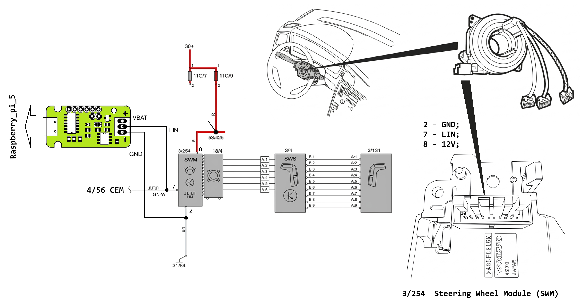

### Vehicle-side connector pinout specifications.

|| Location | Pin Numbering |
| :---: | :---: | :---: |
|| 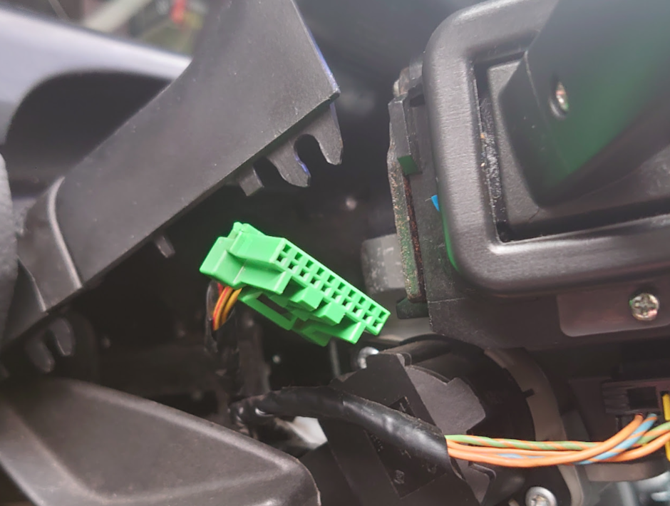 | 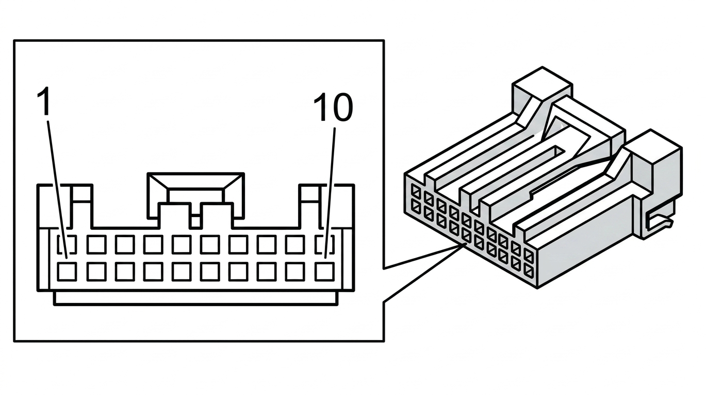 |
| SWM Connector | Vehicle-side connector | Signal type |
| #1 | #1 | - |
| #2 | #2 | Ground |
| #3 | #3 | Control module communication cable CAN_L |
| #4 | #4 | Control module communication cable CAN_H |
| #5 | #5 | - |
| #6 | #6 | - |
| #7 | #7 | Communication cable LIN central electronic module (CEM) |
| #8 | #8 | Power supply |
| #9 | #9 | Windshield wipers |
| #10 | #10 | Horn |

## Decoded Steering Wheel Button Signal Table

| Signal Name   | LIN ID | Data Bytes | Description        | Example Decode |
|--------------|--------|-----------|--------------------|----------------|
| NO_PRESS     | `0x01` | `3F 00`   | No button pressed  | 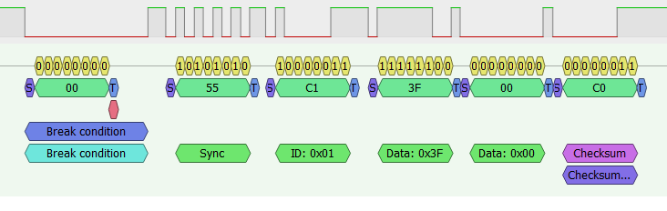 |
| BTN_NEXT     | `0x01` | `3D 00`   | Next track         | 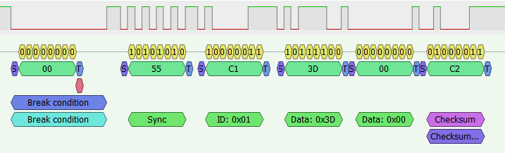 |
| BTN_PREV     | `0x01` | `3E 00`   | Previous track     | 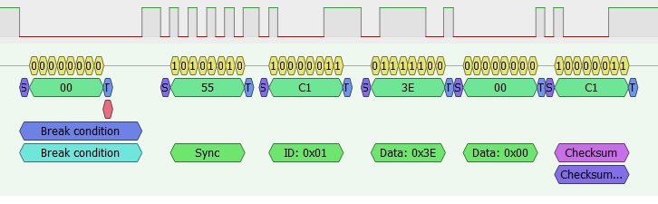 |
| BTN_VOL_UP   | `0x01` | `37 00`   | Volume up          | 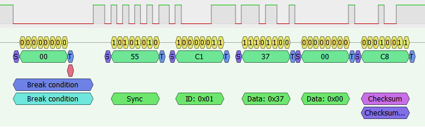 |
| BTN_VOL_DOWN | `0x01` | `3B 00`   | Volume down        | 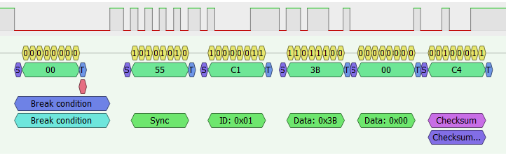 |
| BTN_BACK     | `0x01` | `3F 10`   | Back               | 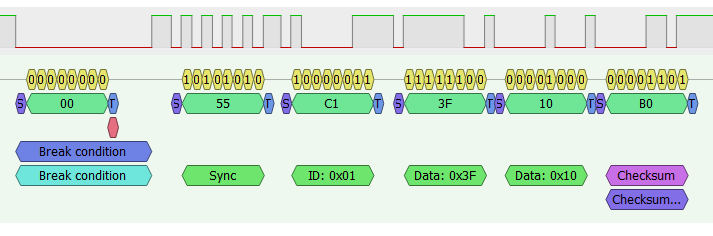 |
| BTN_ENTER    | `0x01` | `3F 20`   | Enter / Select     | 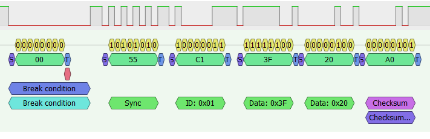 |
| BTN_UP       | `0x01` | `3F 08`   | Navigate up        | 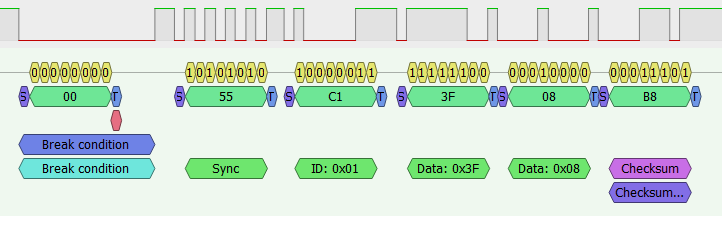 |
| BTN_DOWN     | `0x01` | `3F 04`   | Navigate down      | 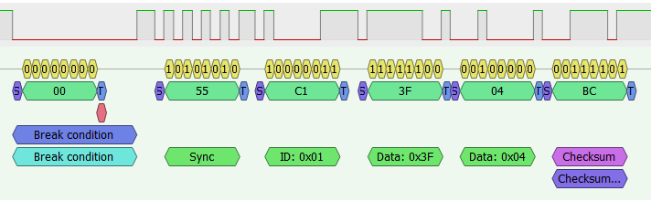 |
| BTN_LEFT     | `0x01` | `3F 02`   | Navigate left      | 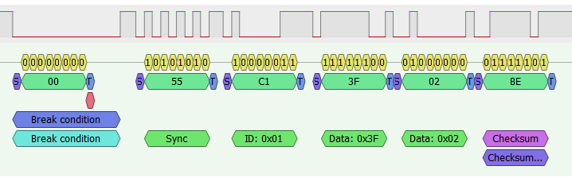 |
| BTN_RIGHT    | `0x01` | `3F 01`   | Navigate right     | 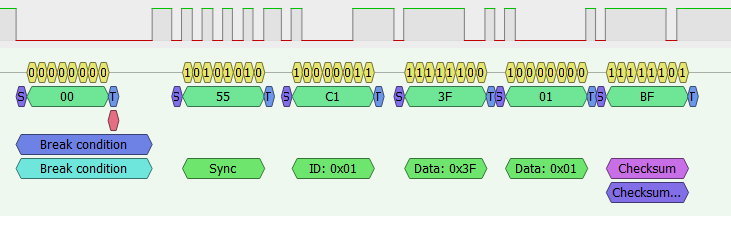 |
| CLL_ANSWR    | `0x01` | `2F 00`   | Answer call        | 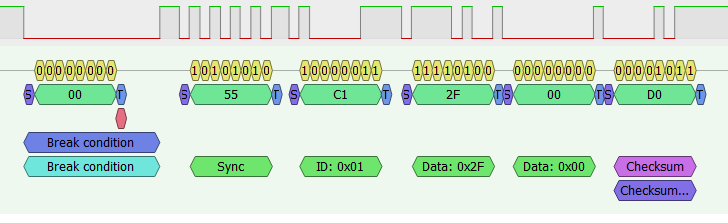 |
| CLL_HNG_UP   | `0x01` | `1F 00`   | Hang up call       | 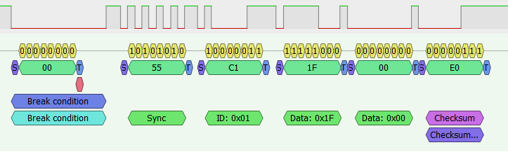 |

This data is reverse-engineered and may vary depending on vehicle model or manufacturer.

All LIN bus data in this project was captured using the
**[USBlini USB-to-LIN interface](https://www.fischl.de/usblini/)** and **[PulseView logic analyzer](https://sigrok.org/wiki/PulseView)**.

### Software Support
- Python library: **[pyUSBlini](https://github.com/EmbedME/pyUSBlini)**

Important: Volvo LIN communication baud rate is 9600 bps.
